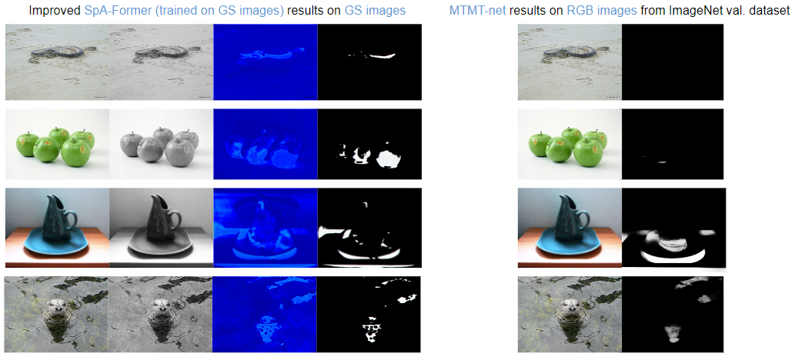
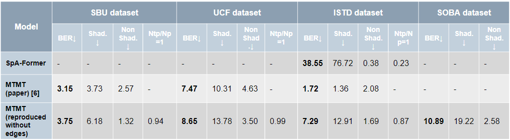
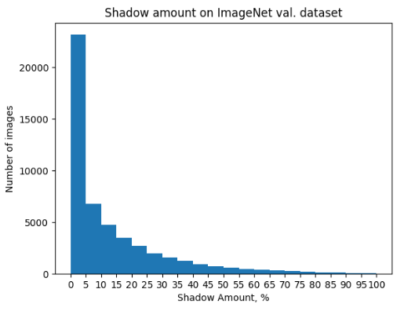

# ShadowProject
Connected repositories:
* [SpAFormer with my changes](https://github.com/jancuz/SpA-Former-shadow-removal.git)
* [MTMT-net with my changes](https://github.com/jancuz/MTMT.git)
* [RobustBench](https://github.com/RobustBench/robustbench.git)
  
## Description

* What do you know about shadows?
* Do they hide a lot of information?
* It's a fact that shadows can help people in object recognition tasks, but do they do the same for DNNs?
* How important are shadows for DNNs in performing object recognition tasks?

Here you can find interesting results in analyzing the role of the shadow component in object recognition task:
* Shadow detection with [SpAFormer](https://github.com/jancuz/SpA-Former-shadow-removal.git) and [MTMT-net](https://github.com/jancuz/MTMT.git) on ImageNet val. dataset
* Shadow amount calculation with MTMT-net on ImageNet val. dataset
* Correlation analysis on ImageNet val. dataset for robust object recognition models:
  * shadow amount and prediction confidence for correctly classified samples and misclassifications
  * shadow amount and mean prediction confidence for correctly classified samples and misclassifications
  * shadow amount and number of correctly classified samples and misclassifications

## Shadow detection on ImageNet val. dataset

On [google-disk], you can find:
* the SpAFormer model
* the MTMT-net model
* the results of shadow detection with [SpAFormer](https://github.com/jancuz/SpA-Former-shadow-removal.git) on ImageNet val. dataset
* the results of shadow detection with [MTMT-net](https://github.com/jancuz/MTMT.git) on ImageNet val. dataset
* result of calculation of shadow amount with MTMT-net (image_shadow.txt)
* test data for robustbench (imagenet_test_image_ids_all_classes.txt)
<p align="center">

## Shadow detection evaluation - BER
For evaluate shadow detection model BER (Balance Error Rate) was used. Here you can see the formula for calculation:
<p align="center">

BER was calculated for the different datasets and two models: [SpAFormer](https://github.com/jancuz/SpA-Former-shadow-removal.git) and [MTMT-net](https://github.com/jancuz/MTMT.git)
<p align="center">

## Shadow amount calculation
<p align="center">

## Shadow amount calculation on ImageNet val. dataset and Correlation Analysis
### MTMT-net
#### Shadow amount calculation and visualization
To calculate the shadow amount with [MTMT-net](https://github.com/jancuz/MTMT.git) on ImageNet val. dataset:
* Place ImageNet val. dataset into the folder ```data```
* Download the MTMT-net model from the [Google Drive](https://drive.google.com/file/d/1s-4BSmz9j8u2_WoUnzNYL0QjRYFEeEkU/view?usp=share_link) and place it into the folder ```models```
* Run the ```test_MT.py``` with the specified path to the data and model:

```
python test_MT.py --root_path "path_to_the_data" --snapshot_path "path_to_the_model" --epoch_name "epoch_name" --dataset_name "ImageNet_val" --shadow_count True
```
* to save the output of the model (shadow-detected masks) use the following command:
```
python test_MT.py --root_path "path_to_the_data" --snapshot_path "path_to_the_model" --epoch_name "epoch_name" --dataset_name "ImageNet_val" --shadow_count True --save_result True --test_save_path "path_to_save_model_output"
```
To visualize the shadow amount with [MTMT-net](https://github.com/jancuz/MTMT.git) on ImageNet val. dataset:
* Calculate the shadow amount using the previous steps or download the file ```image_shadow.txt``` from the [google-disk]
* Run the ```shadow_amount_visualization.py``` with the specified path to the data:

```
python shadow_amount_visualization.py --image_shadow_txt "path_to_the_image_shadow_txt_file" --save_plot_path "path_to_the_graph" --save_no_shadow_info_path "path_to_txt_file_to_save_no_shadow_images_names"
```  

For the ImageNet val. dataset shadow amount was calculated and visualized:
<p align="center">
 
* ImageNet val. dataset consists of 50.000 images
* 7.574 images (0,15%) in ImageNet val. dataset do not have shadows at all

#### Correlation analysis btw. shadow amount and prediction confidence of the robust models
The models used to predict the object class were used from the [RobustBench](https://robustbench.github.io/#div_imagenet_Linf_heading). In order to use the robustbench models follow the instruction [here](https://github.com/RobustBench/robustbench#model-zoo-quick-tour) to install the robustbench.

The robustbench is limited to the number of test images (<=5000 images) for the ImageNet dataset. To do the model evaluation on the whole validation dataset (50.000 images) download ```imagenet_test_image_ids_all_classes.txt``` from [Google Drive](), upload this file into the ```helper_files``` folder, and change the ```loaders.py``` file line 70:
```
        samples = make_custom_dataset(
            self.root, 'helper_files/imagenet_test_image_ids_all_classes.txt',
            class_to_idx)
```

The correlation analysis can be done by running the file ```robust_model_prediction_shadow_visualization.py``` in folder ```object_recognition_models```. To plot different graphs use the specified method with the specified arguments in the main path of the script ```robust_model_prediction_shadow_visualization.py```, for example:
```
val_shadow_confidence_scatter_bar_sns(n_examples, shadow_path, model_name, 
                                          dataset, threat_model, 
                                          x_test_path, y_test_path, paths_test_path)
```
and then run the script ```robust_model_prediction_shadow_visualization.py``` using ```python robust_model_prediction_shadow_visualization.py```

Here you can see the result of the correlation btw. shadow amount and prediction confidence for correctly classified samples and misclassifications on val. dataset ImageNet for the ```Liu2023Comprehensive_Swin-L``` model from robustbench.

<p align="center">

In the same way, you can get different visualizations for different models from robustbench, for example for the ```Salman2020Do_R50``` model from robustbench:

<p align="center">

### SpA-Former

## Results
Shadows may actually help in object recognition!
* correct predictions with more shadow information are more confident
* misclassification with more shadow information are less confident
* looking through the graph with the number of predictions (correct/incorrect) and the shadow amount, we can see that the shadow amount from 0% to 50% increases the chances of the correct prediction (the number of correct predictions is higher than the number of misclassification)

Also, some interesting stuff noticed:
* when the shadow amount is more than 80%, the confidence of the model tends to fluctuate, and it seems like a lot of shadow information (>80%) reduces model confidence for the right prediction and increases the chances for misclassification
* and all described observations are true for both robust models (more robust and less robust models)

