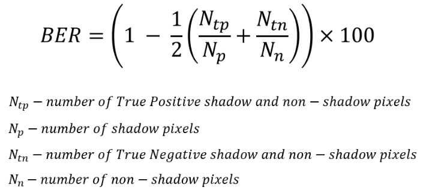

# ShadowProject
## Description

* What do you know about shadows?
* Do they hide a lot of information?
* It's a fact that shadows can help people in object recognition tasks, but do they do the same for DNNs?
* How important are shadows for DNNs in performing object recognition tasks?

Here you can find interesting results in analyzing the role of the shadow component in object recognition task:
* Shadow detection with [SpAFormer](https://github.com/jancuz/SpA-Former-shadow-removal.git) and [MTMT-net](https://github.com/jancuz/MTMT.git) on ImageNet val. dataset
* Shadow amount calculation with MTMT-net on ImageNet val. dataset
* Correlation analysis on ImageNet val. dataset for robust object recognition models:
  * shadow amount and prediction confidence for correctly classified samples and misclassifications
  * shadow amount and mean prediction confidence for correctly classified samples and misclassifications
  * shadow amount and number of correctly classified samples and misclassifications

## Shadow detection on ImageNet val. dataset

On [google-disk], you can find:
* the SpAFormer model
* the MTMT-net model
* the results of shadow detection with [SpAFormer](https://github.com/jancuz/SpA-Former-shadow-removal.git) on ImageNet val. dataset
* the results of shadow detection with [MTMT-net](https://github.com/jancuz/MTMT.git) on ImageNet val. dataset

## Shadow detection evaluation - BER
For evaluate shadow detection model BER (Balance Error Rate) was used. Here you can see the formula for calculation:

BER was calculated for the different datasets and two models: [SpAFormer](https://github.com/jancuz/SpA-Former-shadow-removal.git) and [MTMT-net](https://github.com/jancuz/MTMT.git)

## Shadow amount calculation

## Correlation Analysis and Observations

## Used Works

